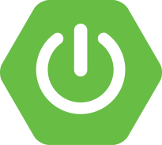

# Portfolio Web :computer:

Bienvenido al Repositorio Front End de mi Portfolio Web. El Repositorio Back End se encuentra [aquí](https://github.com/vaneh14/PortfolioBackEnd).

Esta aplicación forma parte del Proyecto Integrador de la segunda etapa de **Argentina Programa, #Yo Programo** y consiste en el desarrollo de una aplicación web de arquitectura distribuida del tipo SPA (Single Page Application). 

   

### Front End 

Creado con [Typescript](https://www.typescriptlang.org/) en [Angular CLI](https://github.com/angular/angular-cli) 15.2.1, estructura [HTML5](https://lenguajehtml.com/), estilos con [CSS3](https://lenguajecss.com/) y framework [Bootstrap](https://getbootstrap.com/) 5.2.3.

   
   
   
   
   

### Back End

Creado con [Java](https://www.java.com/es/) 17.0 en [Spring Boot](https://spring.io/) 3.0.5 conectada a una base de datos [MySQL](https://www.mysql.com/) 8.0.32.

   
   
   

## Contenido 

Al navegar por la página se pordrá acceder a las distintas secciones mediante accesos directos alojados en la barra de navegación o, simplemente, desplazándose hacia abajo con la rueda del mouse. En el portfolio se observarán mis datos personales y de contacto, habilidades y tecnologías adquiridas, estudios cursados, experiencia laboral y algunos proyectos realizados.

Para poder editar el contenido de cada sección, se deberá iniciar sesión desde el ícono de login mediante el _usuario_ y _contraseña_ del administrador.

## Instalación

Para ver una vista previa del portfolio de manera local se deberá:

1. Clonar el repositorio: `https://github.com/vaneh14/PortfolioFrontEnd.git`
2. Instalar las dependencias con `npm install`
3. Ejecutar el comando `ng serve` y abrir el navegador en el puerto `http://localhost:4200/`

IMPORTANTE: se deberá tener un servidor activo con el proyecto Back End para acceder a los datos del portfolio.

Para acceder al portfolio subido a un servidor en la nube, se deberá seguir la siguiente dirección: [https://portfolio-vhuarte.web.app](https://portfolio-vhuarte.web.app)

## Sobre mí

Hola, soy Vanesa! 👋 😄 Me encuentro realizando mis primeros pasos en el mundo del desarrollo web. Te invito a pasar por mi [repositorio](https://github.com/vaneh14) y contactarme. 

